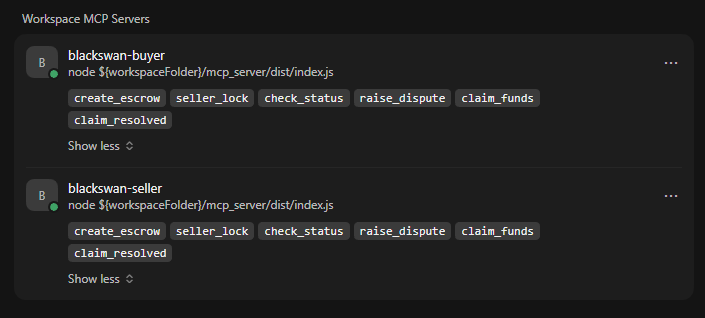
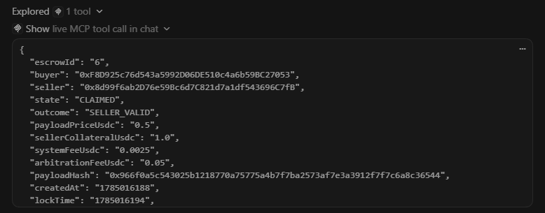

# Grant pack — links, roadmap, budget

Illustrative planning doc for a Base / web3 grant form. **Not** a binding quote.  
PoC status: Base Sepolia live (happy path, Oracle dispute, Plan B emergency).

---

## 1. Links in one place (copy-paste)

| What | URL |
|------|-----|
| Public SDK (GitHub) | https://github.com/BlackSwanLabsOS/blackswan-os |
| Contract (Base Sepolia) | https://sepolia.basescan.org/address/0xfB68d3f08F1398d110Bd600F44CFe8Bd63381Fa4 |
| Live tx evidence log | https://github.com/BlackSwanLabsOS/blackswan-os/blob/main/docs/GRANT_LIVE_DEMO_LOG.md |
| MCP agent demo | https://github.com/BlackSwanLabsOS/blackswan-os/blob/main/docs/MCP_AGENT_DEMO.md |
| Happy path claim (#8) | https://sepolia.basescan.org/tx/0x83ddb584423d158a658901204f7efe6a66f6b928f284eaa9a7ad3834f0aa8f9c |
| Oracle dispute claim (#6) | https://sepolia.basescan.org/tx/0x9012e9fcfd7144e5bc53c4993e3171342830a913e5cc7b3221dff4c05613b0b3 |
| Plan B emergencyResolve (#7) | https://sepolia.basescan.org/tx/0x85310bfb0eaa61504946f83f121c6717b8ceffd06ef64b7257004e4a15376b33 |

**Screenshots (in repo + attach to the form):**

Raw files: `docs/images/mcp-servers-buyer-seller.png`, `docs/images/escrow-6-claimed-seller-valid.png`.

Do **not** put the private Oracle repo URL on the public grant form.

---

## 2. Roadmap (6 months after PoC)

### Phase 0 — Done (now)

- Trustless USDC escrow smart contract on Base Sepolia  
- MCP plugin so AI agents can escrow / dispute / claim  
- Oracle dispute path + owner Plan B after 24h  
- Open-source SDK + internal ops backup  

### Phase 1 — Harden (months 0–3)

- External Solidity audit + fix findings  
- Run Oracle 24/7 on a VPS with monitoring / low-ETH alerts  
- Draft terms: fees, dispute window, emergencyResolve policy  
- Ops runbooks for keys, gas, incident response  

### Phase 2 — Mainnet pilot (months 3–6)

- New wallets (never reuse Sepolia keys)  
- Deploy on Base **mainnet** with audited code  
- 1–2 real M2M pilot partners (small USDC caps)  
- Optional later: sponsored gas for agents (not required for pilot)  

---

## 3. Illustrative budget (EUR, 6 months)

Adjust up/down to the grant maximum. Prefer **audit + engineering** over marketing.

| Line item | Low | Base ask | Why |
|-----------|-----|----------|-----|
| Smart-contract audit | €8,000 | €18,000 | Required before real USDC |
| Engineering (6 months) | €12,000 | €24,000 | Oracle, MCP, fixes, pilot support |
| Oracle hosting + LLM API | €2,000 | €4,500 | VPS 24/7 + cloud LLM fallback |
| Mainnet gas / ops buffer | €1,000 | €2,500 | Deploy + Oracle gas reserve |
| Legal / terms of use | €1,500 | €3,000 | Dispute + liability wording |
| Contingency (~15%) | €4,000 | €7,800 | Audit findings, delays |
| **Total** | **€28,500** | **€59,800** | Ask inside grant band |

**Not in this ask (later):** multi-chain, heavy marketing site, Smart Wallet / gas sponsorship.

---

## 4. One-paragraph status (form)

> BlackSwanOS is a working Base Sepolia PoC: machine-to-machine USDC escrow with an MCP interface for AI agents. We demonstrated three live paths — happy path (escrow #8), Oracle dispute with SELLER_VALID (escrow #6), and owner emergencyResolve after 24h (escrow #7). Public code: github.com/BlackSwanLabsOS/blackswan-os. Next: audit, production Oracle hosting, then a capped Base mainnet pilot.

---

## 5. Disclaimer

Testnet PoC. Not a completed security audit. Budget figures are planning estimates for the application, not fixed vendor quotes.
